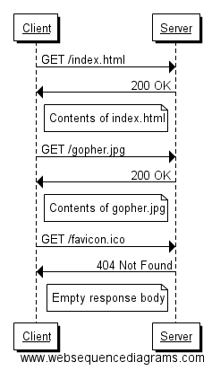
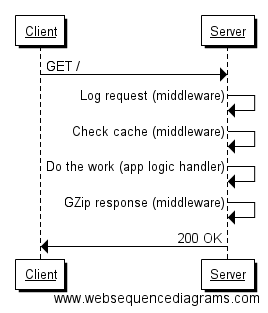

# Building Web Application with Go | BaltimoreGolang Jan, 2017

The following material is geared towards those with limited experience in web application development, especially with the Go programming language. Each section briefly introduces a concept and jumps right into a relevant exercise to get you implementing it in Go. The workshop leader (and helpers, if present), are available through it all to answer questions, dive a little deeper as needed and provide idiomatic examples along the way.

> If you are experienced at building web apps with a different language, you can certainly skip some of the exercises.

## HTTP Basics
**HTTP**, short for Hypertext Transfer Protocol, serves as the foundation upon which "the web" is built. It defines a **protocol** by which one entity (a *client*) may *request* resources (e.g. text, images, videos) from another entity (a *server*) that then provides an appropriate *response*.

This interaction is facilitated through a set of HTTP-defined *methods* (e.g. `GET`, `POST`, `PUT`, `PATCH`, `DELETE`) followed by a resource identifier (e.g. `index.html`, `/some/path/to/image.jpg`) sent by the client to which the server then responds with a response code (e.g. `200 OK`, `404 Not Found`) and payload as appropriate.

A typical client-server interaction may look like the following:



> The term `client` may refer to a browser, another server or a command line tool like `curl` for example. The role of `server` is simply assigned to whichever entity is providing the response the client seeks if it can.

There are tons of resources for understanding HTTP. Point your favorite search engine at something like "understanding http" for more.

### Where does Go come in?
Using the Go programming language, you can write code that fulfills the "server" role in the client-server relationship. Out of the box, Go comes with a `net/http` package in its standard library, enabling the creation of programs that will listen for and respond to HTTP requests from clients.

> Explain?: "package", "standard library"

### Exercise 1: The Teapot Server
Using the `net/http` package, write a Go program that starts up and listens on port 9000 for incoming HTTP requests. It should respond with the status code for "I'm a teapot" (yes, it's real) regardless of the request.

Criteria:

- When program starts, it should output something to STDOUT so we know it's running (e.g. "Running...")
- Use the `log` package for your logging needs
- Handle any incoming request regardless of HTTP verb or resource and respond with the appropriate status code with no response body

Extra Credit:

- Log the remote address of the calling client, the HTTP method and request URI used in the request to STDOUT

> Solution: https://play.golang.org/p/_1O3di9Sk0 You should copy the code and run it locally. Extra-extra credit: Explain why the Go Playground fails the program.

## Web Servers vs Application Servers
As a developer working on web applications, your job will typically revolve around handling incoming client requests that your application supports. Before we get into specifics, there's an important distinction to be made with regards to servers. 

A "web server" (popular ones include the Apache Web Server, NGINX, Microsoft IIS) serves up content that is often (but not always) static in nature, such as text (HTML documents, JavaScript, XML, JSON, SVG, etc) and binaries (JPG, PNG, video, etc). On the other hand, the term "application server" is used to imply that further business logic is at play to dynamically build a response that may differ from request to request.

### Where does Go come in?
As a Go developer, the tools at your disposal make the distinction between web server and application somewhat immaterial. First, let's see how you can create a "traditional" server that serves up static content from disk with a few lines of code.

### Exercise 2: The Static Server
Again, using just the standard library Go provides, build an application that serves up resources found in a folder on your hard drive.

Criteria:

- Use of the standard library's `http.FileServer`
- When running, going to `http://localhost:9000/` (optional trailing slash) serves up the index.html located in the directory you're serving up
- You do not have to retain the request logging from the first exercise. We'll come back to that during the upcoming "middleware" exercise.

Extra Credit:

- Give your program the ability to take a directory `path` to serve from as a configuration parameter.
- Handle the case where an invalid path is passed in (e.g. a dir that does not exist, a file, etc) by failing to launch the server altogether.

> Solution (without the Extra Credit): https://play.golang.org/p/0Mafw63PAt. Alternatively: https://play.golang.org/p/Nytn655MEW. Extra Credit: Can you explain the difference?

## Routing & Handlers
A common term in web application development is **routing** (or **route**). As the name implies, given the URL path in an incoming HTTP request (e.g. /some/path/to/resource), the server will determine where to "route" the request, in other words, what piece of code should handle the business logic that satisfies the needs of the client before returning a response. You'll often here the terms "multiplexer", "muxer" or just "mux" when discussing routing and handling.

So far, we've been able to implement our servers using nothing more than a well-placed function that satisfies the `http.Handler` interface. 

> Whoa, whoa, `interface`? (Deeper dive into Go Interfaces if needed.)

When we defined the `handler` function during the first exercise (shown again here)...

```
func handler(w http.ResponseWriter, r *http.Request) {
	log.Printf("%s %s %s", r.RemoteAddr, r.Method, r.RequestURI)
	w.WriteHeader(http.StatusTeapot)
}
```

...we were implicitly satisfying the `http.Handler` interface shown here:

```
type Handler interface {
        ServeHTTP(ResponseWriter, *Request)
}
```

This in turn allowed us to hand over the `handler` to the `http.HandleFunc` function which expects that whatever you pass in as that second argument, will have a `ServeHTTP` function that it can call to pass in an `http.ResponseWriter` and a pointer to an `http.Request` object.

> Whoa, whoa, again with the new terms. What's a `pointer`? (Deeper dive into Go and pointers if needed...)

To put it concretely, when we wrote the `main` function as...

```
func main() {
	http.HandleFunc("/", handler)
	log.Println("Running...")
	http.ListenAndServe(":9000", nil)
}

```

...we were passing in `handler` while knowing it would satisfy the needs of `http.HandlerFunc`.

Note that when we started our server with `http.ListenAndServe`, we didn't even have to mention anything about the `handler` function we'd set up earlier in the program. Go did us a solid and used its `http.DefaultServeMux` (which is just an `http.ServeMux` initiated with `http.NewServeMux()` behind the scenes) so that our `handler` would have something to hang on to and be used to handle our designated route, in this case "/" and anything after it. 

> Note: `http.Handle` and `http.HandleFunc` simply use the `http.DefaultServeMux` behind the scenes but you can create your own muxer. `http.ListenAndServe` falls back to using the `http.DefaultServeMux` if `nil` is passed in as the second argument.

You can (and often) will create your own mux in your Go programs, especially if you're not using the standard library. 

Let's see how we can use the `http.ServeMux` type to specify a redirect handler:

```
func main() {
  mux := http.NewServeMux()

  rh := http.RedirectHandler("http://baltimoregolang.org", http.StatusTemporaryRedirect)
  mux.Handle("/baltimoregolang", rh)

  log.Println("Running...")
  http.ListenAndServe(":9000", mux)
}
```

Here we're using one of Go's built-in http functions, `http.RedirectHandler`, which returns an `http.Handler` that meets the criteria for passing it to our muxer's `Handle` func.

> Note that `mux` here is of type `*http.ServeMux`. Also note the use of `http.StatusTemporaryRedirect` instead of the "magic" int 307 to specify the http response code that gets sent to the client.

### Exercise 3: The Discerning Server
Our previous exercises have all focused on handling requests sent to the root of our app (at "/"). We want to get a little more specific in our handling and add some functionality in the process. We're going to route requests to "/proverbs" to our static proverbs content (see Exercise 2 solution for assets) and respond with nothing in the body (with a 200 OK) if the client sends the request to the root ("/").

Criteria:

- Requests to "/proverbs" loads up our static content as we did before in the 2nd exercise.
- Requests to "/" respond with `200 OK` and no response body.

> Solution: https://play.golang.org/p/8Z0nByB_zI. Note the use of both `http.ServeMux`'s `HandleFunc` and `Handle` methods.

## Middleware
As you build a web app, you'll find it common to want to reuse one or more pieces of functionality for some or all HTTP requests. A common implementation pattern for such functionality lies in what's referred to as *middleware*. As the name implies, they act upon the incoming request and before your response goes back out to the client through the handlers that handle your application logic.

Imagine that for every request sent to your application, you want to log it, check a cache before doing some heavy processing,  perform the actual work needed and finally compress the response before responding to the client. The following figure illustrates what we rant:



### Where does Go come in?
Creating and using middleware in Go requires just a couple of steps:

1. Have the middleware implement satisfy the `http.Handler` interface
2. Allow your middleware to be chainable by itself returning an `http.Handler`

Take the following example:

```
func myMiddleware(next http.Handler) http.Handler {
  return http.HandlerFunc(func(w http.ResponseWriter, r *http.Request) {
    // Do something here
    next.ServeHTTP(w, r)
  })
}
```

Our handler's return, an anonymous function here, is able to satisfy the `http.Handler` interface and call on the next handler in the chain with `next.ServeHTTP(w, r)`.

By returning an `http.Handler`, we can attach `myMiddleware` to an `hit.ServeMux` and chain handlers (e.g. `http.Handle("/", myMiddleware(anotherMiddleware(someHandler)))`).

### Exercise 4: The Middleman (sorta)
Let's say we want to log some information about the incoming requests from Exercise 2 so we can see all the resources being asked for by the client as we did in Exercise 1.

Your task is to implement a handler that can be chained with the `http.ListenAndServe` call.

Criteria:

- Write a chainable handler function
- Use your handler by wrapping the `http.FileServer` call within the `http.ListenAndServe` invocation.